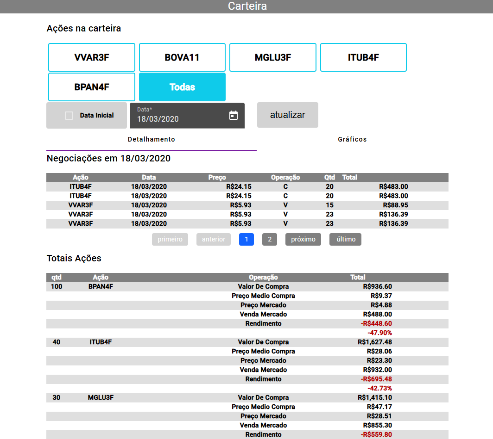
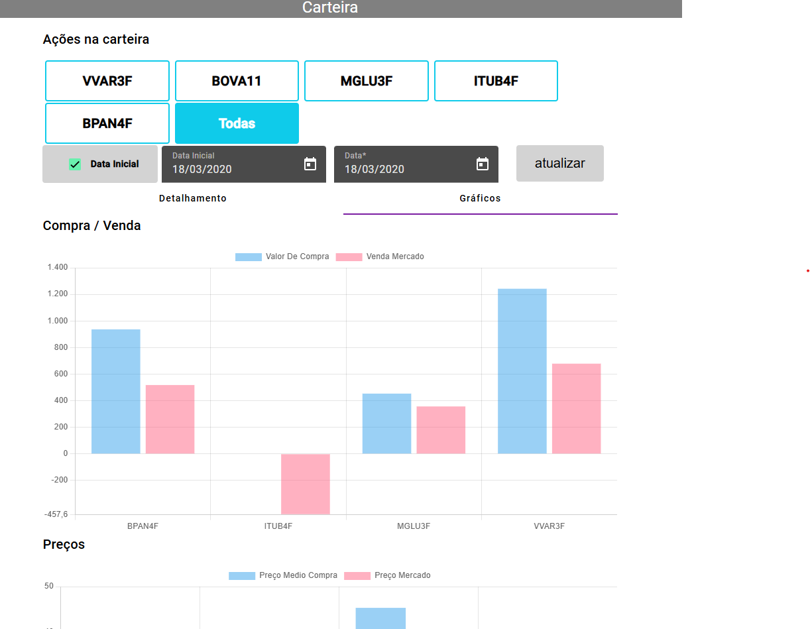

# desafio-gz 

- Aplicação com uma API SPRING e um front em ANGULAR para   o acompanhamento da carteira de investimentos  

em `cd .\front-desafio-gz\` se encontra front end  da aplicação ` ng serve` para rodar

em `cd .\back\desagio-fsbr\` se encontra back end  da aplicação 

# Front
- Angular 17
 
# Back 
- Java 17 
- Spring 

# prints das telas 

## tela   principal 

## tela   graficos 

 

